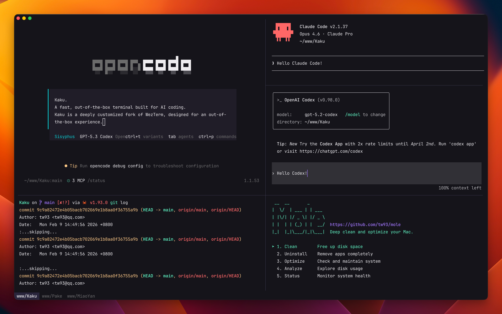

  <h1>Steklo</h1>
  
<em>A fast, out-of-the-box terminal built for AI coding.</em>

  
  
  
  
  

  
   
  Steklo is a deeply customized fork of <a href="https://github.com/wez/wezterm">WezTerm</a>, designed for an out-of-the-box experience.

## Features

- **Zero Config**: Defaults with JetBrains Mono, opencode theme, macOS font rendering, and low-res font sizing.
- **Curated Shell Suite**: Built-in zsh plugins with optional CLI tools for prompt, diff, and navigation workflows.
- **Fast & Lightweight**: 40% smaller binary, instant startup, lazy loading, stripped-down GPU-accelerated core.
- **WezTerm-Compatible Config**: Use WezTerm's Lua config directly with full API compatibility and no migration.

## Quick Start

1. [Download Steklo DMG](https://github.com/tw93/Steklo/releases/latest) & Drag to Applications
2. Or install with Homebrew: `brew install tw93/tap/stekloku`
3. Open Steklo. The app is notarized by Apple, so it opens without security warnings
4. On first launch, Steklo will automatically set up your shell environment

## Usage Guide

Steklo comes with intuitive macOS-native shortcuts:

| Action | Shortcut |
| :--- | :--- |
| New Tab | `Cmd + T` |
| New Window | `Cmd + N` |
| Close Tab/Pane | `Cmd + W` |
| Navigate Tabs | `Cmd + Shift + [`, `Cmd + Shift + ]` or `Cmd + 1-9` |
| Navigate Panes | `Cmd + Opt + Arrows` |
| Split Pane Vertical | `Cmd + D` |
| Split Pane Horizontal | `Cmd + Shift + D` |
| Toggle Split Direction | `Cmd + Shift + S` |
| Zoom/Unzoom Pane | `Cmd + Shift + Enter` |
| Resize Pane | `Cmd + Ctrl + Arrows` |
| Clear Screen | `Cmd + K` |
| Steklo AI Settings | `Cmd + Shift + A` |
| Steklo Assistant Apply Suggestion | `Cmd + Shift + E` |
| Open Lazygit | `Cmd + Shift + G` |
| Yazi File Manager | `Cmd + Shift + Y` or `y` |
| Font Size | `Cmd + +`, `Cmd + -`, `Cmd + 0` |
| Smart Jump | `z <dir>` |
| Smart Select | `z -l <dir>` |
| Recent Dirs | `z -t` |

## Configuration

Steklo comes with a carefully curated shell stack for immediate productivity, so you can focus on AI coding without opening vscode:

Built-in zsh plugins bundled by default:

- **z**: A smarter cd command that learns your most used directories for instant navigation.
- **zsh-completions**: Extended command and subcommand completion definitions.
- **Syntax Highlighting**: Real-time command validation and coloring.
- **Autosuggestions**: Intelligent, history-based completions similar to Fish shell.

Optional CLI tools installed via Homebrew during `steklo init`:

- **Starship**: A fast, customizable prompt showing git status, package versions, and execution time.
- **Delta**: A syntax-highlighting pager for git, diff, and grep output.
- **Lazygit**: A terminal UI for fast, visual Git workflows without leaving the shell.
- **Yazi**: A terminal file manager. Use `y` to launch it and sync the shell directory on exit.

Steklo uses `~/.config/steklo/steklo.lua` for configuration, fully compatible with WezTerm's Lua API, with built-in defaults at `Steklo.app/Contents/Resources/steklo.lua` as fallback.

Run `steklo` in your terminal to see all available commands such as `steklo update`, `steklo reset`, `steklo config`, and `steklo ai`.

## Steklo AI

Steklo includes a built-in assistant for command-line error recovery and a unified settings UI for external AI coding tools.

- **Steklo Assistant**: Automatically analyzes failed commands and prepares a safe command suggestion.
- **AI Tools Config**: Manage settings for tools like Claude Code, Codex, Gemini CLI, Copilot CLI, Factory Droid, OpenCode, and OpenClaw.

Open AI settings with `steklo ai`, then configure **Steklo Assistant** (enable, model, base URL, API key) and your external AI tools in one place.

Tip: DeepSeek-V3.2 is a great low-cost option to start with for everyday AI coding tasks.

When Steklo Assistant has a suggestion ready after a command error, press `Cmd + Shift + E` to apply it.

## Why Steklo?

I heavily rely on the CLI for both work and personal projects. Tools I've built, like [Mole](https://github.com/tw93/mole) and [Pake](https://github.com/tw93/pake), reflect this.

I used Alacritty for years and learned to value speed and simplicity. As my workflow shifted toward AI-assisted coding, I wanted stronger tab and pane ergonomics. I also explored Kitty, Ghostty, Warp, and iTerm2. Each is strong in different areas, but I still wanted a setup that matched my own balance of performance, defaults, and control.

WezTerm is robust and highly hackable, and I am grateful for its engine and ecosystem. Steklo builds on that foundation with practical defaults for day one use, while keeping full Lua-based customization and a fast, lightweight feel.

So I built Steklo to be that environment: fast, polished, and ready to work.

### Performance

| Metric | Upstream | Steklo | Methodology |
| :--- | :--- | :--- | :--- |
| **Executable Size** | ~67 MB | ~40 MB | Aggressive symbol stripping & feature pruning |
| **Resources Volume** | ~100 MB | ~80 MB | Asset optimization & lazy-loaded assets |
| **Launch Latency** | Standard | Instant | Just-in-time initialization |
| **Shell Bootstrap** | ~200ms | ~100ms | Optimized environment provisioning |

Achieved through aggressive stripping of unused features, lazy loading of color schemes, and shell optimizations.

## FAQ

1. **Why is the Homebrew cask named `stekloku` instead of `steklo`?**

   The name `steklo` conflicts with another package in Homebrew's official repository (an unmaintained music player). `stekloku` is a cute variation that's easy to remember.

2. **Is there a Windows or Linux version?**

   Not at the moment. Steklo is currently macOS-only while we focus on polishing the macOS experience. Windows and Linux versions may come later once the macOS version is mature.

3. **Can Steklo use transparent windows on macOS?**

   Yes. You can set `window_background_opacity` and optionally `macos_window_background_blur` in `~/.config/steklo/steklo.lua`. Transparent mode now keeps top/right/bottom padding regions visually consistent to avoid transparent gaps.

4. **How do I turn off copy on select?**

   Steklo enables copy on select by default; to disable automatic clipboard copy and copy toast after selection, add `config.copy_on_select = false` to `~/.config/steklo/steklo.lua`.

## Contributors

Big thanks to all contributors who helped build Steklo. Go follow them! ❤️

## Support

- If Steklo helped you, star the repo or [share it](https://twitter.com/intent/tweet?url=https://github.com/tw93/Steklo&text=Steklo%20-%20A%20fast%20terminal%20built%20for%20AI%20coding.) with friends.
- Got ideas or found bugs? Open an issue/PR or check [CONTRIBUTING.md](CONTRIBUTING.md) for details.
- Like Steklo? <a href="https://miaoyan.app/cats.html?name=Steklo" target="_blank">Buy Tw93 a Coke</a> to support the project! 🥤 Supporters below.

## License

MIT License, feel free to enjoy and participate in open source.
